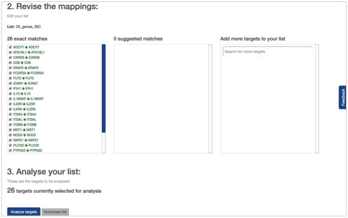

# Batch search

Go to our [homepage](https://www.targetvalidation.org/) and click on the link [new batch search](https://www.targetvalidation.org/batch-search), which is below the search box.

Upload my list \(as a`.txt`or`.csv`\), or copy and paste it into the box. If I paste my list, I will need to give it a name so that I can get back to it later. Hit the`Load`button:

Scroll down the page to revise the mappings. There may be genes Open Targets could not map to my list of targets. If that is the case, I may want to double check their names using the suggested matches. I can have my list of targets as HGNC gene symbols or Ensembl Gene IDs. Hit

`Analyze targets`

button.

## What results will I get from the batch search tool? 

I will get a summary page for my targets divided into four sections:

### 1\) Diseases associated 

I can view the diseases classified either by Therapeutic areas \(e.g. Immune system disease, Digestive system disease\), or divided by the data types \(e.g Genetic associations, Somatic mutations\) used for the association.

Open Targets rank the diseases according to the probability of finding a disease associated with **my** set of targets. So I need to look out for the\_p\_value.

### 2\) Pathways 

I will find the pathways associated with my targets with a\_p\_value available for the ranking.

When I click on the pathway names, e.g. [NOD1/2 Signaling Pathway](https://www.targetvalidation.org/summary?pathway=R-HSA-168638&pathway-target=NOD2&pathway-target=CARD9), I will get the pathway diagram and links to Reactome.

### 3\) Drugs 

I will get the drugs from ChEMBL that match my list of genes, the target name, the most advanced stage in clinical trials, and the molecule type.

When I click on a drug name, e.g. [NATALIZUMAB](https://www.targetvalidation.org/summary?drug=CHEMBL1201607), I will get general properties of that drug and links to DailyMed and ChEMBL.

### 4\) Interactions between targets 

I will get a summary of interactions for my set of targets based on the data from [OmniPath DB](http://omnipathdb.org/).

I can select any two targets in the network and find the details of the interaction between them.

Note that the current limit on the number of targets you can upload \(or paste in\) is 200.

