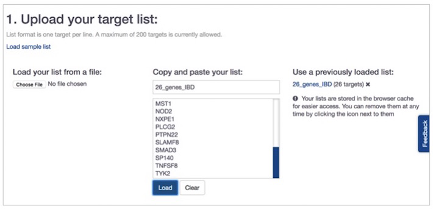

# Batch search

Go to our [homepage](https://www.targetvalidation.org/) and click on the link [new batch search](https://www.targetvalidation.org/batch-search), which is below the search box.

Upload your target list \(as a`.txt`or`.csv`\), or copy and paste it into the box. If you paste your list, you need to give it a name, so that you can get back to it later. Hit the`Load`button:

Scroll down the page to revise the mappings. If your targets can't be mapped as exact matches, you will see a list of suggested matches. Click on the suggested target symbol to view a list of suggested alternatives, and select the symbol you like. You can upload your list of targets as HGNC gene symbols, Ensembl Gene IDs, UniProt IDs or protein names, and gene synonyms. Hit`Analyse targets`button.

## What results will I get from the batch search tool? {#whatresultswilligetfromthebatchsearchtool}

You will get a summary page with the results divided into five sections:

### 1\) Diseases associated {#1diseasesassociated}

You will get the associated diseases, which are classified either by Therapeutic areas, the default view \(e.g. Immune system disease\), or by Data types \(e.g Genetic associations\).

We rank the associated diseases according to the probability of finding a disease associated with **your **set of targets. We use the [hypergeometric distribution](https://en.wikipedia.org/wiki/Hypergeometric_distribution) as an attempt to order the most relevant diseases associated with your list of targets. Look out for the relevance \_p\_value in the results table.

### 2\) Pathways {#2pathways}

You will get the pathways associated with your targets and ranked by the \_p\_value \(as outlined above\).

Click on the pathway names, e.g. [NOD1/2 Signaling Pathway](https://www.targetvalidation.org/summary?pathway=R-HSA-168638&pathway-target=NOD2&pathway-target=CARD9) to get to its diagram from Reactome.

### 3\) Drugs {#3drugs}

You will get the drugs from ChEMBL matching your list of targets, the target name, the most advanced stage in clinical trials, and the molecule type of the drug compound.

Click on the drug name, e.g. [NATALIZUMAB](https://www.targetvalidation.org/summary?drug=CHEMBL1201607) to get general properties of that drug and links to DailyMed and ChEMBL.

### 4\) Gene Ontology {#4interactionsbetweentargets}

You will get the gene ontology terms enriched in you list of targets, ranked by the relevance \_p\_value \(as outlined above\).

### 5\) Interactions between targets {#4interactionsbetweentargets}

You will get a summary of protein interactions based on the data from [OmniPath DB](http://omnipathdb.org/) for any two targets from your list.

Note that the current limit on the number of targets you can upload \(or paste in\) is 200.

For a demo of the batch search, check our tutorial video [How to search for many drug targets at once with Open Targets](https://www.youtube.com/watch?v=CPkAxnVrt_s).

