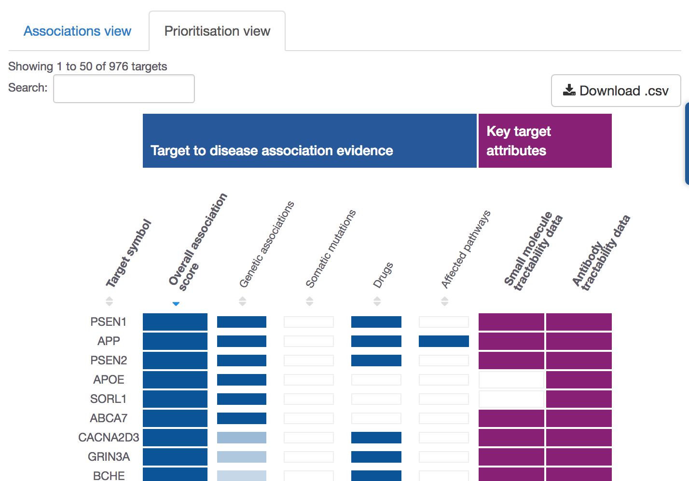

# Target tractability

Target tractability is the confidence that you can identify a modulator that interacts with your target of interest, and can elicit a desired biological effect. 

The assessment of target tractability allows you to exploit target details, such as whether there is a binding site in the protein that can be used for small molecule binding, or an accessible epitope for antibody based therapy. This can assist in target prioritisation, drug target inclusion in discovery pipelines and selection of therapeutic modalities that are most likely to succeed.

Another advantage of tractability data is that it allows you to exploit targets for which there are no ligands or experimental structure, or those targets which are outside a "druggable" target family, but which have strong genetic associations.

Our target tractability is based on a modified version of [Approaches to target tractability assessment – a practical perspective](https://pubs.rsc.org/en/content/articlelanding/2018/md/c7md00633k#!divAbstract). We have been working with our partners to evaluate and validate existing tractability methods. The data that is available in our Open Targets Platform is the first step of this project: _in silico_ tractability assessment pipeline of 20,633 targets for small molecules and antibodies.

Each of these targets is described following a hierarchical qualitative buckets of tractability based on data from UniProt, HPA, PDBe, DrugEBIlity, ChEMBL, Pfam, InterPro, Complex Portal, DrugBank, Gene Ontology, and BioModels. 

| Buckets | Small molecule                                             | Monoclonal antibody |
| :--- | :--- | :--- |
| 1 | Targets with drugs in phase IV | Targets with drugs in phase IV |
| 2 | Targets with drugs in phase II or above | Targets with drugs in phase II or above |
| 3 | Pre-clinical targets | Preclinical targets |
| 4 | Targets with crystal structures with ligands  | Targets located in the plasma membrane  |
| 5 | Targets with a drugEBIlity score equal or greater than 0.7 | Targets with GO cell component terms plasma membrane or secreted |
| 6 | Targets with drugEBIlity between zero and 0.7 | Targets with GO cell component terms plasma membrane or secreted with low or unknown confidence |
| 7 | Targets with ligands | Targets with predicted signal peptide and transmembrane domains |
| 8 | Targets with a predicted Ro5 druggable domain \(druggable genome\) | GO cell component - medium confidence |
| 9 | N.A. | Human Protein Atlas - high confidence |

When you search for a disease, you will find the list of target associated with that disease. By default, the table shows the `Associations view`. We now provide an additional view called `Prioritisation view`, where you will see some key target attributes, such as tractability information, in addition to target to disease association evidence. This is what you will find when searching for the [targets associated with Alzheimer's](https://www.targetvalidation.org/disease/EFO_0000249/associations) and click on the "Prioritisation view":



For any of those targets, we will highlight whether small molecule or antibody have been predicted to tract the target. Click on any of the cells coloured in light purple to get redirected to the target profile page. 

In the profile page of a target, such as [PSEN1](https://www.targetvalidation.org/target/ENSG00000080815?view=sec:tractability), you will see the following:


Under `Target tractability`, you will see three different categories corresponding to the buckets 1-8 listed above, which depends on the drug modality available i.e. either small molecule \(A\) or antibody \(B\):

* A\) small molecule: 

  * clinical precedence: buckets 1, 2 and 3
  * discovery precedence: buckets 4 and 7
  * predictable tractable: buckets 5, 6 and 8

* B\) antibody:
  * clinical precedence
  * predictable tractable - high confidence
  * predictable tractable - medium to low confidence

In addition to the association page for a disease and the target profile page, you can also retrieve target tractability data with our REST API by using the `private/target` endpoint:

```
curl -X GET https://api.opentargets.io/v3/platform/private/target/ENSG00000000938
```

