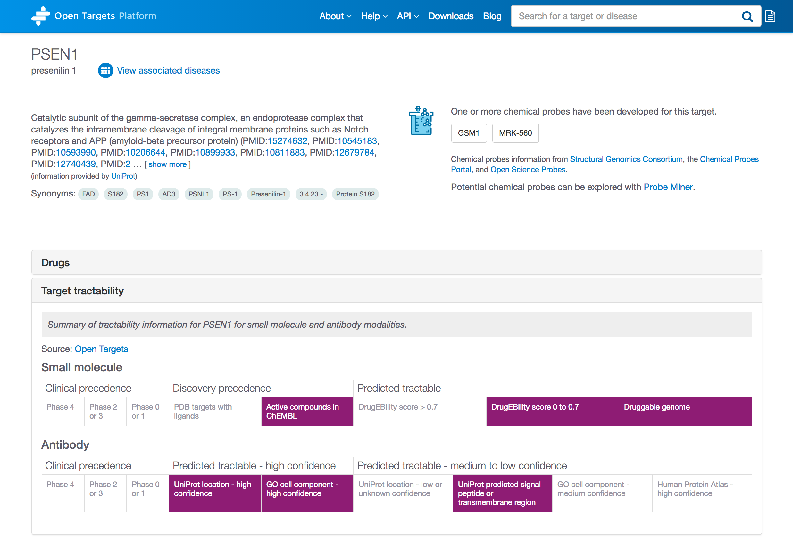

# Target tractability

Target tractability is the confidence that you can identify a modulator that interacts with your target of interest, and can elicit a desired biological effect. 

The assessment of target tractability allows you to exploit target details, such as whether there is a binding site in the protein that can be used for small molecule binding, or an accessible epitope for antibody based therapy. This can assist in target prioritisation, drug target inclusion in discovery pipelines and selection of therapeutic modalities that are most likely to succeed.

Another advantage of tractability data is that it allows you to exploit targets with no ligands or experimental structure, those targets which are outside a "druggable" target family, but which have strong genetic associations.

Our target tractability is based on a modified version of [Approaches to target tractability assessment – a practical perspective](https://pubs.rsc.org/en/content/articlelanding/2018/md/c7md00633k#!divAbstract). We have been working with our partners to evaluate and validate existing tractability methods. The data that is available in our Open Targets Platform is the first step of this project: _in silico_ tractability assessment pipeline of 20,633 targets for small molecules and antibodies.

Each of these targets is described following a hierarchical qualitative buckets of tractability based on data from UniProt, HPA, PDBe, DrugEBIlity, ChEMBL, Pfam, InterPro, Complex Portal, DrugBank, Gene Ontology, and BioModels. 

| Buckets | Small molecule                                             | Monoclonal antibody |
| :--- | :--- | :--- |
| 1 | Targets with drugs in phase IV | Targets with drugs in phase IV |
| 2 | Targets with drugs in phase II or above | Targets with drugs in phase II or above |
| 3 | Pre-clinical targets | Preclinical targets |
| 4 | Targets with crystal structures with ligands  | Targets located in the plasma membrane  |
| 5 | Targets with a drugEBIlity score equal or greater than 0.7 | Targets with GO cell component terms plasma membrane or secreted |
| 6 | Targets with drugEBIlity between zero and 0.7 | Targets with GO cell component terms plasma membrane or secreted w low or unknown confidence |
| 7 | Targets with ligands | Targets with predicted signal peptide and transmembrane domains |
| 8 | Targets with a predicted Ro5 druggable domain \(druggable genome\) | GO cell component - medium confidence |
| 9 | N.A. | Human Protein Atlas - high confidence |

Some of these buckets have be combined into the following categories: available in the target profile page for any target such as FGR: 

* Clinical precedence: buckets 1, 2 and 3
* Discovery precedence: buckets 4 and 7
* Predictable tractable: buckets 5, 6 and 8

This is available under Target tractability in the target profile page of any target, such as [FGR](https://www.targetvalidation.org/target/ENSG00000000938?view=sec:tractability). If you want  to retrieve this information with the REST API, you should use the `private/target` endpoint:

```
curl -X GET https://api.opentargets.io/v3/platform/private/target/ENSG00000000938
```

In addition to the target profile pages, you can find which modalities, if any, are available to tract your target of interest. When you search for a disease such as Alzheimer's, you will get to the associations page showing all [targets associated with Alzheimer's](https://www.targetvalidation.org/disease/EFO_0000249/associations). Click on the "Prioritisation view" next to the "Associations view" to get the key target attributes based on the therapeutic modality predicted for the target, either small molecule, antibody or both.


Click on any of the cells coloured in light purple to get redirected to the target profile page and explore the buckets available for small molecules or antibody tractability data.



